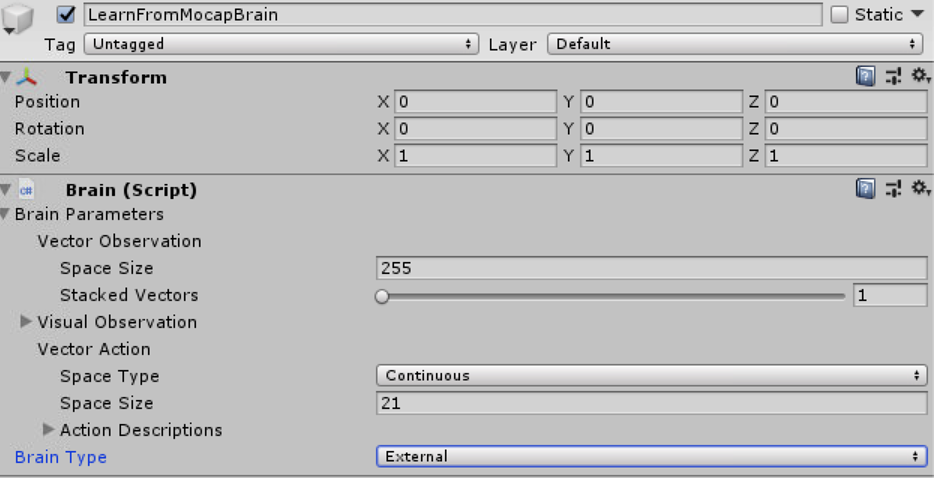

# ActiveRagdollStyleTransfer
Research into using mocap (and longer term video) as style reference for training Active Ragdolls / locomotion for Video Games

(using Unity ML_Agents + [MarathonEnvs](https://github.com/Unity-Technologies/marathon-envs))

----

#### Goals
* Train active ragdolls using style reference from MoCap / Videos
* Integrate with [ActiveRagdollAssaultCourse](https://github.com/Sohojoe/ActiveRagdollAssaultCourse) & [ActiveRagdollControllers](https://github.com/Sohojoe/ActiveRagdollControllers) 

----

#### Using this repro
* Make sure you are using a compatable version of Unity (tested with 2018.4 LTS and 2019.1)
* To run trained models, make sure you: [add TensorFlowSharp to Unity](https://github.com/Unity-Technologies/ml-agents/blob/master/docs/Using-TensorFlow-Sharp-in-Unity.md) 
* To try different moves: Replace reference MoCap in animation tree and select the right ML-Agent trained model
* To re-train:

  * Make sure you've installed ml-agents of this project before by
```sh
pip install .
```
  * Set the `LearnFromMocapBrain` to External 
  * Build the project
  * From the root path, invoke the python script like this: `mlagents-learn config\style_transfer_config.yaml --train --env="\b\StyleTransfer002\Unity Environment.exe"  --run-id=StyleTransfer002-145` where `"\b\StyleTransfer002\Unity Environment.exe"` points to the built project and `StyleTransfer002-145` is the unique name for this run. (Note: use `/` if on MacOS/Linux)
  * See the [ML-Agents documentation](https://github.com/Unity-Technologies/ml-agents) for more details on using ML-Agents

* Post an Issue if you are still stuck

----

#### Contributors
* Joe Booth ([SohoJoe](https://github.com/Sohojoe))

----

#### Download builds : [Releases](https://github.com/Sohojoe/ActiveRagdollStyleTransfer/releases/)

----

## StyleTransfer002

Backflip (002.144-128m steps) |
--- | 
 | 

| Running (002.114) | Walking (002.113) | 
--- | ---- |
 |  | 

* **Model:** MarathonMan (modified MarathonEnv.DeepMindHumanoid)
* **Animation:** Runningv2, Walking, Backflip
* **Hypostheis:** Implement basic style transfer from mo-cap using MarathonEnv model
* **Outcome:** Is now training on Backflip
  * Initial was able to train walking but not running (16m steps / 3.2m observations)
  * Through tweaking model was able to train running (32m steps / 6.4m observations)
  * Was struggling to train backflip but looks like I need to train for longer (current example is 48m steps / 9.6m observations)
  * Was able to train Backflip after updating to Unity 2018.3 beta - looks like updates to PhyX engine improve stability
* **References:** 
  * Insperation: [DeepMimic: Example-Guided Deep Reinforcement Learning of Physics-Based Character Skills arXiv:1804.02717 [cs.GR]](https://arxiv.org/abs/1804.02717)
* **Notes:**
  * Needed to make lots of modifications to model to improve training performance
  * Added sensors to feet improved trainging
  * Tweaking joints improved training
  * Training time was = ~7h for 16m steps (3.2m observations) **TODO: check assumptions**
  * New Training time is + 2x
  * ... Optimization: Hack to Academy to have 4 physics only steps per ml-step
  * ... Optimization: Train with 64 agents
  * ... also found training in headless mode --no-graphics helped
  * **Updated to Unity 2018.3 Beta for PhysX improvements** 
  * see [RawNotes.002](RawNotes.002.md) for details on each experiment


## StyleTransfer001

* **Model:** U_Character_REFAvatar
* **Animation:** HumanoidWalk
* **Hypostheis:** Implement basic style transfer from mo-cap
* **Outcome:** FAIL
  * U_Character_REFAvatar + HumanoidWalk has an issue whereby the feet collide. The RL does get learn to avoid - but it feels that this is slowing it down
* **References:** 
  * Insperation: [DeepMimic: Example-Guided Deep Reinforcement Learning of Physics-Based Character Skills arXiv:1804.02717 [cs.GR]](https://arxiv.org/abs/1804.02717 
* **Raw Notes:**
  * Aug 27 2018: Migrate to new repro and tidy up code so to make open source

